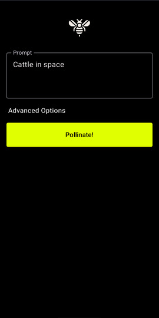

# Pollinator

**Pollinator** is an open-source Android application designed to transform text prompts into visually striking AI-generated images. Leveraging the capabilities of [Pollinations AI](https://pollinations.ai), the app offers users the ability to create unique and captivating images in just seconds. Built with Jetpack Compose and Kotlin, Pollinator provides a seamless and intuitive user experience, with a modern design that ensures ease of use. The app’s flexible architecture is designed to accommodate future integrations with other AI-driven services, making it a powerful tool for anyone interested in exploring the creative potential of generative AI.

### Beta Status

**Pollinator** is currently in **beta**. While the app is free & functional, please be aware that it is still under development, and some features may not work as expected. We appreciate your feedback to help improve the app during this phase.

### Terms of Use

By using **Pollinator**, you agree to abide by Pollinations AI's [Terms of Use](https://pollinations.ai/terms). Please review these terms carefully before using the app, as they govern your use of the image generation services provided by Pollinations AI.

## Installation

To install the app on your device, download the latest APK from the [Releases](https://github.com/g-aggarwal/Pollinator/releases/) page and follow the instructions below:

1. **Enable Installation from Unknown Sources:**
   - Go to your device's settings and enable the installation of apps from unknown sources.

2. **Install the APK:**
   - Locate the downloaded APK file on your device and tap it to begin installation.

### Build Prerequisites

- **Android Studio Koala 2024.1.1 Patch 2** or later.
- **Android SDK 34** or later.
- **Kotlin 1.8** or later.

### Build Variants

Pollinator includes two build variants:

- **Debug**: For development and testing.
- **Release**: For production, with minification and obfuscation enabled.

## Dependencies

Pollinator uses the following dependencies:

- **Jetpack Compose**: For building the user interface.
- **Material3**: For modern UI components.
- **OkHttp**: For network requests.

## License

Pollinator is licensed under the GNU General Public License v3.0. See the [LICENSE](LICENSE) file for details.

## Acknowledgments

I would like to extend my sincere appreciation for the [Pollinations AI](https://github.com/pollinations) team!

A special thanks to [Thomas Haferlach](https://github.com/voodoohop) for his support!

